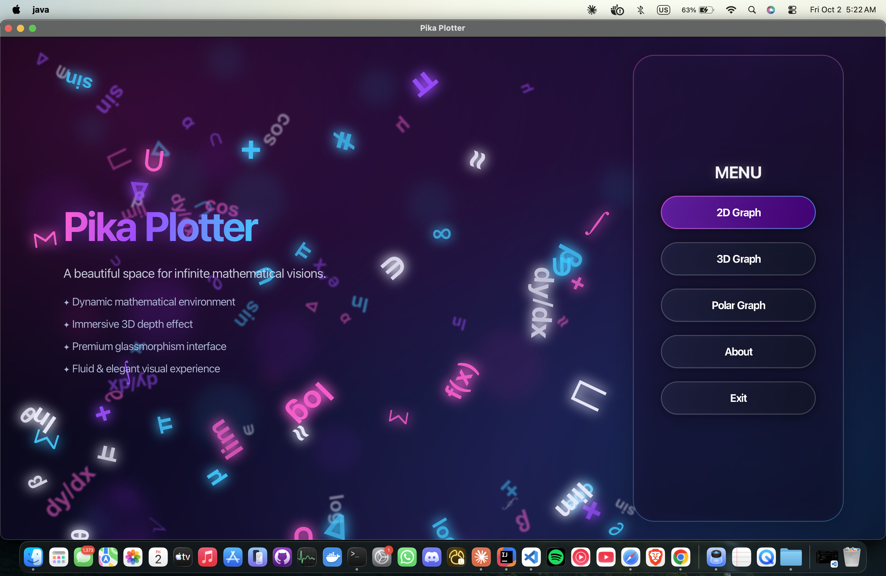
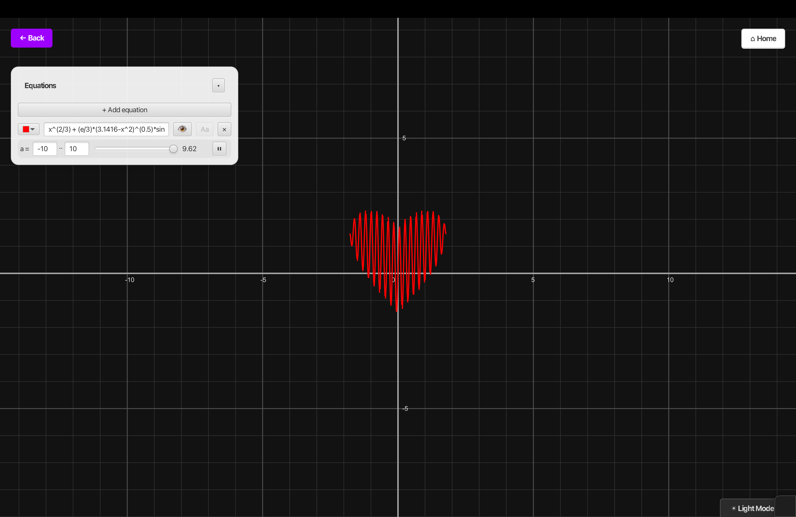
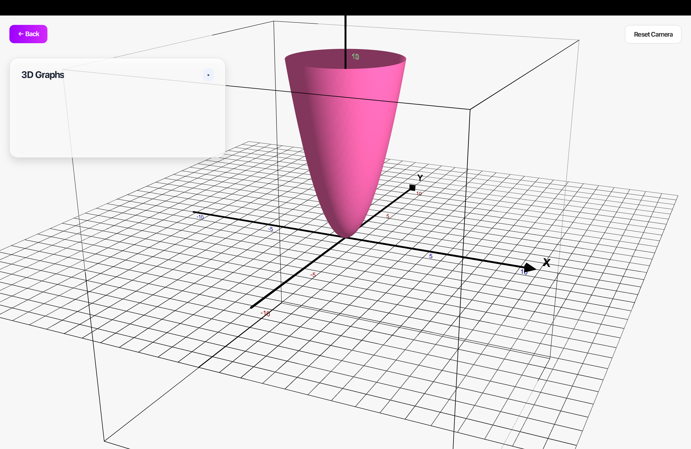
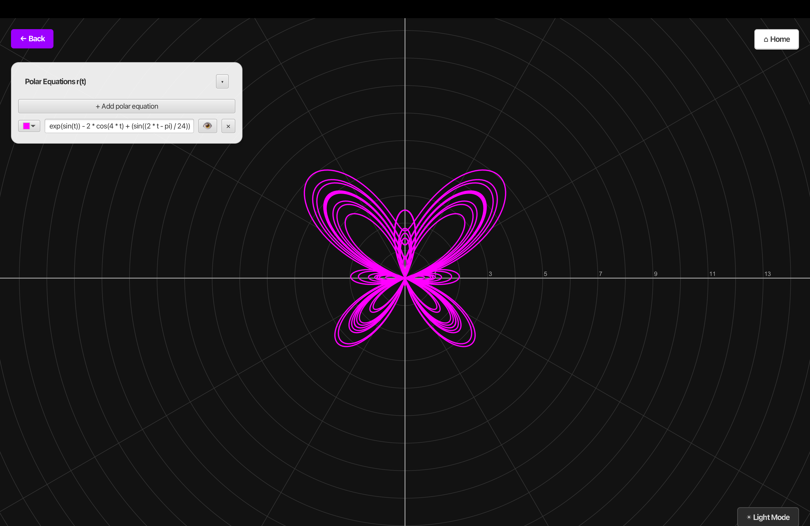
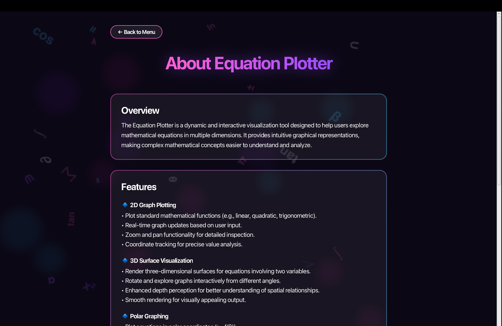
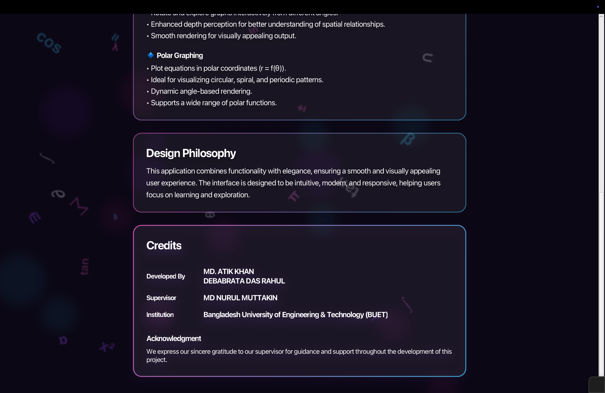

   
  <h1 style="margin-bottom: 0; color: #FF007A; font-family: 'Helvetica Neue', sans-serif; font-size: 3.8em; font-weight: 900; letter-spacing: 4px; text-transform: uppercase; text-shadow: 2px 2px 8px rgba(255, 0, 122, 0.3);">
    ✦ Pika Plotter ✦
  </h1>
  

    The Ultimate High-Performance Mathematical Visualization Engine
  

  

    
    
    
    
  

 

<blockquote style="border-left: 6px solid #FF007A; background-color: #FFF0F8; padding: 25px; border-radius: 8px; font-family: 'Segoe UI', sans-serif; color: #333; font-size: 1.15em; box-shadow: 0 4px 15px rgba(255, 0, 122, 0.1);">
  <strong>"Mathematics is the music of reason."</strong> 
  <em>— James Joseph Sylvester</em>
</blockquote>

 

## 🌌 An Elegant Interface: The Main Menu

  
  
<i>The immersive entry point to Pika Plotter, featuring floating mathematical symbols and a premium glassmorphism interface.</i>

### ✧ A Beautiful Space for Infinite Visions
The application greets users with a visually stunning, dynamic environment. The UI is built entirely from scratch to provide a **fluid and elegant visual experience**, integrating premium glassmorphism design concepts. From here, users can seamlessly transition between 2D, 3D, and Polar graphing engines.

## 📐 2D Cartesian Engine: Precision & Dynamics

  
  
<i>Dark Mode: Complex animated heartbeat equation with a live parameter slider.</i>

### ✧ Features & Technical Implementation
* **Real-Time Graph Updates:** Plot standard mathematical functions (linear, quadratic, trigonometric) with instantaneous rendering.
* **Live Parameter Sliders (`a`, `b`, `c`):** As seen in the Dark Mode "Heart" graph, introducing an unknown variable like `a` auto-generates a sleek UI slider. Dragging it—or pressing the play/pause toggle—triggers a hardware-accelerated Canvas redraw, turning static formulas into fluid motion.
* **Interactive Navigation:** Full support for Zoom and Pan functionality for detailed mathematical inspection, complete with coordinate tracking for precise value analysis.

## 🧊 3D Surface Topology

  
  
<i>3D Mapping of <code>x^2 + y^2 = z</code> featuring spatial grid rendering and depth colorization.</i>

### ✧ Features & Technical Implementation
* **Multivariable Rendering:** Seamlessly isolate `x`, `y`, and `z` planes, rendering three-dimensional surfaces for equations involving two variables.
* **Spatial Camera Controls:** Rotate and explore graphs interactively from varying angles. Users can click and drag to orbit around the topological surface, experiencing enhanced depth perception for spatial relationships.
* **Dynamic Multi-Graphing:** The 3D engine supports multiple concurrent inputs, allowing users to stack Standard Surfaces, Implicit 3D equations, and Parametric Curves simultaneously.

## 🌀 Polar & Parametric Kinematics

  
  
<i>Polar Mode: Highly complex, animated "Butterfly" curve mapping <code>r(t)</code>.</i>

### ✧ Features & Technical Implementation
* **Dynamic Angle-Based Rendering:** Plot equations in polar coordinates `(r = f(θ))`, ideal for visualizing circular, spiral, and periodic patterns.
* **Custom Radial Grid Engine:** When switching to Polar mode, the Cartesian grid is swapped for a beautiful concentric radial grid system, tracking standard angle measures.
* **Parametric Time Sweeping `(t)`:** Maps massive, complex trigonometric outputs (like the butterfly curve) using highly dense step calculations to prevent aliasing during live temporal animations.

## 👨‍💻 About The Project & Credits

  
  

### ✧ Design Philosophy
Pika Plotter combines heavy mathematical functionality with high-end elegance, ensuring a smooth and visually appealing user experience. The interface was engineered to be intuitive, modern, and highly responsive, helping users maintain focus entirely on learning and spatial exploration.

### ✧ Project Credits
This application was developed as a comprehensive academic and passion project at the **Bangladesh University of Engineering & Technology (BUET)**.
* **Developed By:** MD. Atik Khan & Debabrata Das Rahul
* **Supervisor:** MD Nurul Muttakin

*We express our sincere gratitude to our supervisor for guidance and support throughout the development of this visualization engine.*

## ✧ Installation & Build Instructions

Ensure you have <strong>Java 21+</strong> and <strong>Apache Maven</strong> installed. The <code>pom.xml</code> file automatically fetches all required JavaFX OS-specific binaries and the Exp4j core.

<pre style="color: #F8F8F2; font-family: 'Fira Code', Consolas, monospace; margin: 0; font-size: 0.95em;">
# 1. Clone the repository
git clone https://github.com/yourusername/pika-plotter.git

# 2. Navigate into the directory
cd pika-plotter

# 3. Clean and compile the application
mvn clean compile

# 4. Launch the Visualization Engine
mvn javafx:run
</pre>

 

  

    Designed and built with ❤️ and <strong>Advanced Calculus</strong>.
  

